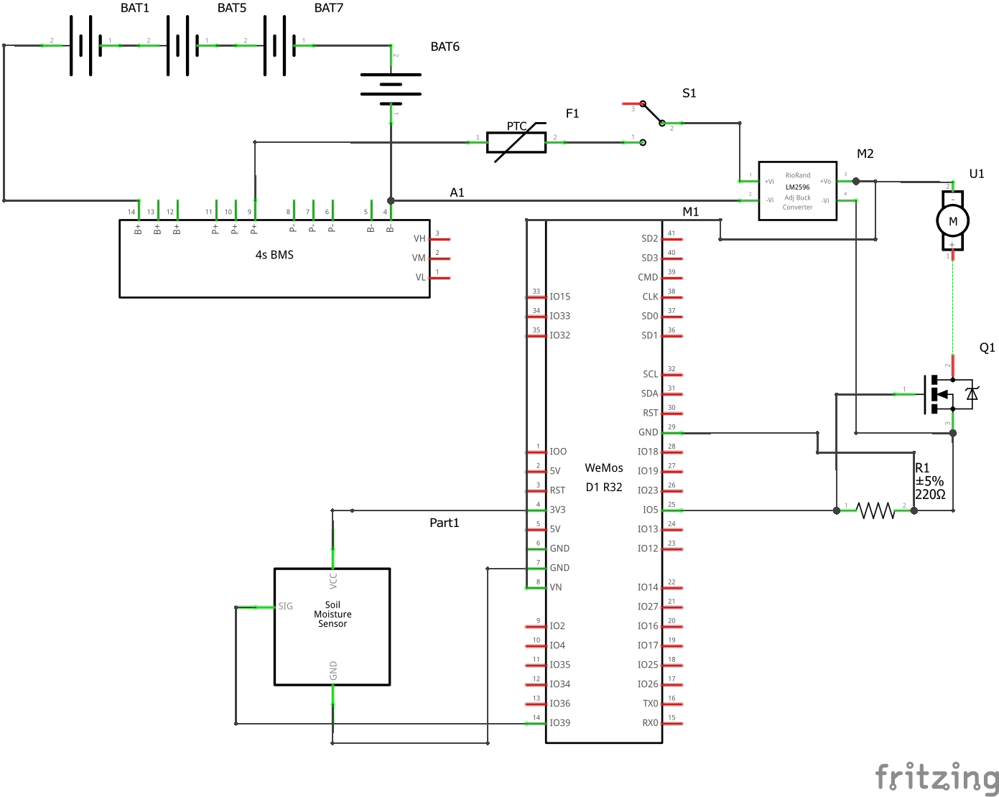
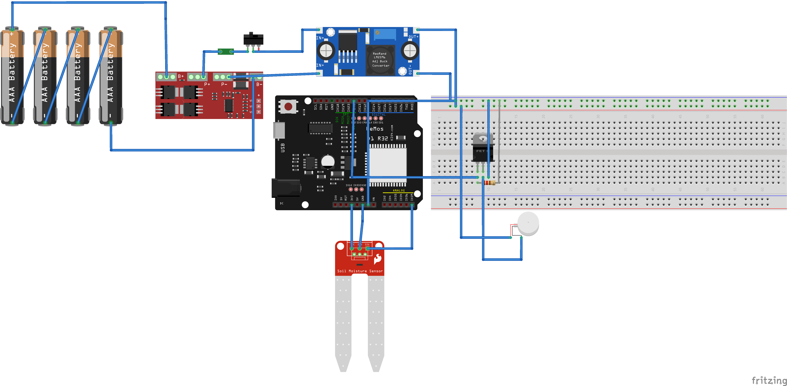

# ESP32 alapú okos öntözőrendszer

Ez a repository a Projektmunka I–II keretében fejlesztett ESP32 alapú automata öntözőrendszer forráskódját, dokumentációját és kapcsolódó ábráit tartalmazza.

A projekt első részében egy akkumulátoros, talajnedvesség-alapú automata öntözőrendszer készült. A második projektfázisban a rendszer továbbfejlesztésre került kapacitív talajnedvesség-érzékelővel, időjárás-előrejelzési adatok feldolgozásával, bővített webes felülettel és Home Assistant integrációval.

A rendszer kapacitív talajnedvesség-érzékelővel méri a talaj nedvességtartalmát, majd a mért értékek és az időjárás-előrejelzési adatok alapján dönt az öntözés szükségességéről. A vezérlés saját webes kezelőfelületen keresztül is elérhető, valamint MQTT kommunikáción keresztül Home Assistant rendszerbe integrálható.

## Fő funkciók

- Talajnedvesség mérése SOIL CAP-V2.0 kapacitív érzékelővel
- Nyers ADC érték százalékos talajnedvesség-értékké alakítása
- Automatikus és kézi szivattyúvezérlés
- Webes kezelőfelület ESP32-n
- Talajnedvesség és időjárási adatok grafikonos megjelenítése
- Időjárás-előrejelzési adatok lekérése Open-Meteo API-ból
- Várható eső esetén automatikus öntözés tiltása
- Hőmérséklet- és páratartalom-alapú küszöbkorrekció
- MQTT kommunikáció
- Home Assistant integráció
- Beállítások mentése nem felejtő memóriába

## Hardverelemek

- ESP32 D1-R3-WIFI-BT-UNO fejlesztőpanel
- SOIL CAP-V2.0 kapacitív talajnedvesség-érzékelő
- 12 V-os merülőszivattyú
- IRLZ34N N-csatornás MOSFET
- 4S 18650 Li-ion akkumulátorcsomag
- 4S BMS modul
- LM2596 step-down konverter
- Biztosíték
- Főkapcsoló
- IP védett szerelvénydoboz

## Kapcsolási rajz

Az alábbi ábra a rendszer kapcsolási rajzát mutatja be. A kapcsolás fő részei az akkumulátoros tápellátás, a 4S BMS modul, a biztosíték, a főkapcsoló, az LM2596 step-down konverter, az ESP32 vezérlő, a talajnedvesség-érzékelő és a MOSFET-es szivattyúvezérlés.



## Elkészült rendszer

Az alábbi kép a megvalósított öntözőrendszer összeállított állapotát mutatja. A rendszer egy zárt szerelvénydobozban kapott helyet, amely tartalmazza az akkumulátoros tápellátást, a védelmi és vezérlőelektronikát, valamint a külső szenzor- és szivattyúcsatlakozásokat.



## Szoftveres felépítés

A program több fő részből épül fel:

- Wi-Fi kapcsolat kezelése Station módban
- Talajnedvesség-mérés és százalékos skálázás
- Webes kezelőfelület kiszolgálása
- Időjárási adatok lekérése Open-Meteo API-ból
- Öntözési stratégia számítása
- Állapotgép-alapú szivattyúvezérlés
- MQTT kommunikáció Home Assistant felé
- Home Assistant MQTT discovery támogatás
- Beállítások mentése EEPROM-ba

## Beállítás

A publikus forráskód nem tartalmaz valódi Wi-Fi vagy MQTT jelszavakat.

A használathoz a kódban az alábbi mezőket saját adatokkal kell kitölteni:

```cpp
const char *STA_SSID = "";
const char *STA_PASSWORD = "";

const char *MQTT_HOST = "";
const char *MQTT_USER = "";
const char *MQTT_PASSWORD = "";
```

A földrajzi koordináták szintén módosíthatók az aktuális telepítési helynek megfelelően:

```cpp
const float WEATHER_LAT = 0.0f;
const float WEATHER_LON = 0.0f;
```

## Home Assistant integráció

A rendszer MQTT-n keresztül kommunikál a Home Assistant rendszerrel. Az ESP32 a talajnedvesség, a nyers ADC érték, a pumpaállapot, az üzemmód, az időjárási adatok, az esőtiltás és az öntözési stratégia fontosabb állapotait MQTT témákba publikálja.

A Home Assistant MQTT discovery segítségével az entitások automatikusan megjeleníthetők a Home Assistant felületén. A rendszer így nemcsak saját webes felületen, hanem központi okosotthon-felületen keresztül is felügyelhető.

## Repository felépítése

```text
esp32-okos-ontozorendszer/
├── README.md
├── watering_home_assistant/
│   └── watering_home_assistant_public.ino
├── docs/
│   ├── Projektmunka_I.pdf
│   └── Projektmunka_II.pdf
└── images/
    ├── schematic.png
    └── done_project.png
```

## Dokumentáció

A repository tartalmazza a Projektmunka I és Projektmunka II dokumentációját is.

A dokumentációk bemutatják:

- a kiindulási állapotot,
- a hardveres felépítést,
- az akkumulátoros tápellátást,
- a szivattyúvezérlést,
- a talajnedvesség-mérést,
- a szoftveres működést,
- a Home Assistant integrációt,
- a tesztelési eredményeket,
- a további fejlesztési lehetőségeket.

## További fejlesztési lehetőségek

- Napelemes tápellátás kialakítása
- Akkumulátortöltés felügyelete
- ESP32 deep sleep üzemmód használata
- Energiafogyasztás mérése különböző üzemállapotokban
- Több öntözési zóna kezelése
- Víztartályszint-érzékelés
- Saját nyomtatott áramköri lap tervezése
- Hosszabb távú adatnaplózás Home Assistant rendszerben

## Megjegyzés

A publikus forráskód nem tartalmaz valódi Wi-Fi, MQTT vagy egyéb érzékeny adatokat. A saját hálózati beállításokat a felhasználónak helyileg kell megadnia a kódban.

## Készítette

Tóth Ádám  
Óbudai Egyetem  
Kandó Kálmán Villamosmérnöki Kar  
Projektmunka II
